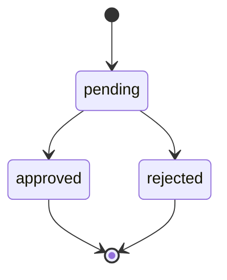
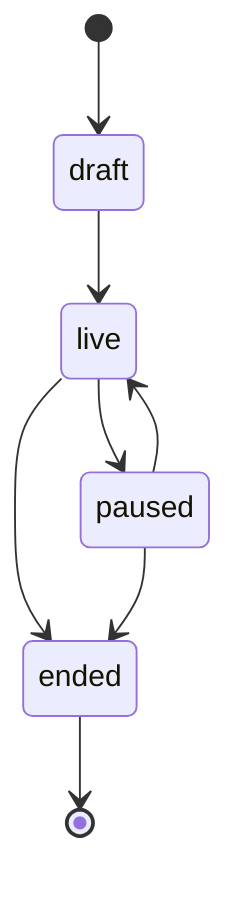
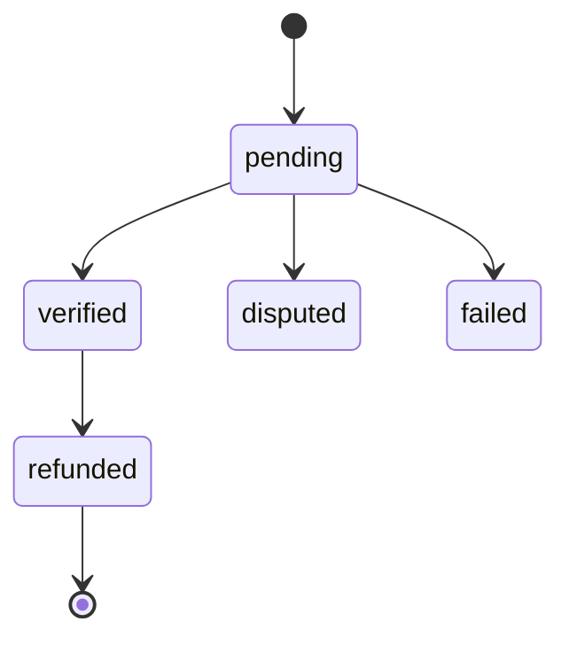
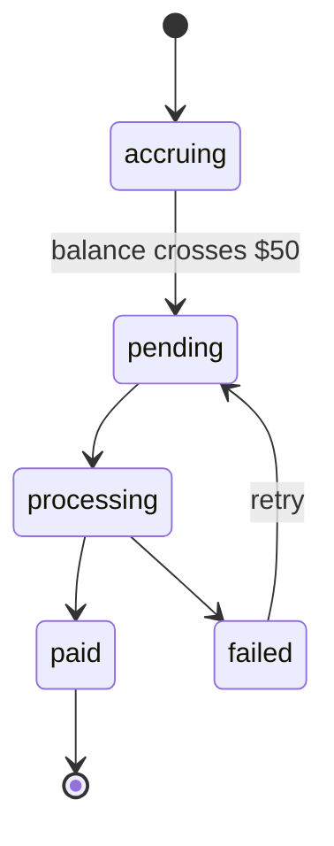

# State Machines

## Purpose

Define the valid states and transitions for the core entities.

## Application State Machine

```
pending → approved (merchant action)
pending → rejected (merchant action)
```

- No transition out of approved/rejected back to pending — a rejected creator submits a new application rather than resurrecting the old one.

## Campaign State Machine

```
draft → live (merchant publishes)
live → paused (merchant pauses)
paused → live (merchant resumes)
live → ended (merchant ends, or automatic end condition)
```

- **Decided default (2026-08-03 — please confirm):**
    - **Paused:** existing approved creators' links keep working — clicks and in-flight sales within the 30-day attribution window are still honored. No *new* applications are accepted while paused.
    - **Ended:** links stop attributing new clicks/sales immediately. Any click that occurred *before* the end date is still honored if the resulting sale happens within the standard 30-day window; clicks after the end date attribute nothing.
- **Commission rate changes mid-flight (decided default 2026-08-03 — please confirm):** changing a campaign's commission rate does not require re-consent from already-approved creators. Each approved creator's existing AffiliateLink keeps the rate that was active when they were approved (locked at approval, not at time of sale — this is slightly different from the Sale-level lock in Business Rules, and worth double-checking these two locking rules don't conflict). New applicants after the change apply at the new rate. This avoids building a re-consent/renegotiation flow for MVP.

## Sale State Machine

```
pending → verified (triggers Commission calculation; commission credited to creator wallet)
pending → disputed / failed
verified → refunded (triggers clawback per Commission Engine's 14-day rule)
```

- "Verified" = payment completed successfully, set the instant Paddle payment clears.

## Payout State Machine

```jsx
wallet accrues (commission credited per verified sale, not yet paid out)
  ↓ (wallet balance ≥ $50)
pending → processing (payout triggered)
processing → paid
processing → failed → pending (retry)
```

- Threshold-based for creators ($50). Merchant payout is NOT threshold-gated (decided default — see Money Flow): merchants ride Paddle's standard rolling payout schedule regardless of sale size, since it's their core revenue rather than a bonus balance.

## Open Questions

- Whether locking a creator's commission rate "at approval" (this doc) vs. "at time of sale" (Business Rules) needs reconciling into one single rule — flagging for proofread since these were written at different points in the conversation and should say the same thing.

## Diagrams

**Application**



**Campaign**



**Sale**



**Payout**



## Update (2026-08-07): Sale States Reversed + New Billing Cycle State Machine

**Sale state machine, updated for external-site tracking (01. Money Flow, reversed):**

```
reported → accepted (merchant's sale report passes acceptance checks, per 04. Fraud Prevention)
reported → rejected (failed verification/fraud check)
accepted → billed (included in a completed merchant billing cycle)
accepted → refunded (merchant reports a refund)
```

Note the terminology shift: **"verified" (meaning SellVia witnessed a direct payment) no longer applies** u2014 replaced by "reported" u2192 "accepted," reflecting that SellVia is trusting a merchant's claim, not confirming a transaction it processed itself.

**New: Billing Cycle state machine**

```
open (accumulating accepted sales for a merchant)
  ↓ (cycle end date reached)
pending_charge → charged (merchant's card successfully billed)
pending_charge → failed → retrying → charged / suspended
charged → creator_payouts_released (per 01. Money Flow's \"bill first, then pay\" default)
```

**Payout state machine, updated:**

```
wallet accrues (commission credited only after the corresponding Billing Cycle reaches "charged" —
  NOT per-sale-instant anymore, per 01. Money Flow's reversed decision)
  ↓ (wallet balance ≥ $50)
pending → processing → paid
processing → failed → pending (retry)
```

## Open Questions

- Exact retry policy for a failed merchant billing charge (how many attempts, over what window, before suspending campaigns) u2014 not yet designed

## Update (2026-08-07): Snippet Verification Gate Added to draft → live

**Founder-confirmed: a Campaign cannot transition from `draft` to `live` until the merchant's tracking snippet is verified installed** (01. Money Flow, 05. Payment Flow) — a second gate alongside the existing Paddle-onboarding-complete requirement (08. Business Edge Cases). Verification: SellVia can check for the snippet's presence via a test ping/handshake when the merchant attempts to publish, rather than just trusting they installed it correctly.

**Both gates on `draft → live` now:**

1. Paddle onboarding complete (08. Business Edge Cases)
2. Tracking snippet verified installed (this update)

Neither is optional — a campaign with no way to receive payouts, or no way to have its sales tracked, shouldn't be able to go live regardless of which gate is missing.

## Update (2026-08-07): Card Failure Policy CONFIRMED

**Confirmed: automatic campaign suspension after 3 failed billing attempts over 3 days** (e.g. immediate retry, then +24h, then +48h) — no longer a working default. On the 3rd consecutive failure:

- Merchant's live Campaigns auto-transition to `paused` (same mechanism already built for Paddle restriction, 08. Business Edge Cases — reused, not reinvented)
- Merchant notified with a clear reason and a way to update their card (02. Frontend Architecture's billing card page)
- BillingCycle stays in `failed` status, accumulating (not lost) until the merchant resolves it and a retry succeeds
- Creators' commission for that cycle remains unpaid until resolved — consistent with bill-first-then-pay (01. Money Flow)