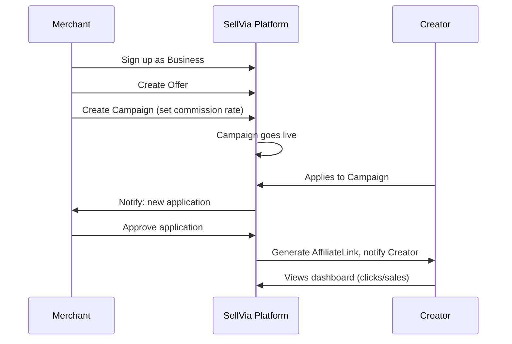
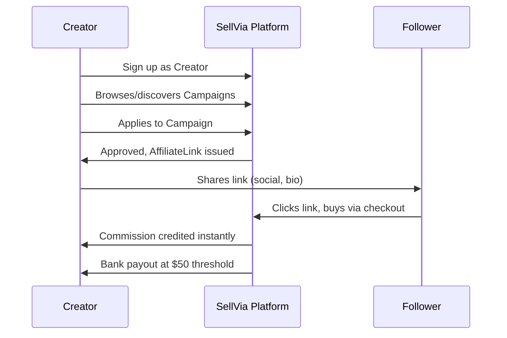

# User Flows

## Purpose

End-to-end paths through the product for each role, so screens and API endpoints have a clear sequence to support.

## Merchant Flow

1. Register / sign up, select "Business" role
2. Create an Offer (name, price, category: digital or physical)
3. Create a Campaign for that Offer: set commission rate, publish
4. Review incoming creator Applications (see each creator's audience/niche/conversion data)
5. Approve or reject applications
6. Dashboard: view clicks/sales/creators per campaign
7. Receive automatic payout notifications as sales verify

## Creator Flow

1. Sign up, select "Creator" role
2. Browse/discover campaigns (by category: digital vs. physical, per raw data doc; by niche/fit, per AI matching discussed for post-MVP)
3. Apply to a campaign with audience info attached
4. On approval, receive a unique AffiliateLink
5. Share the link (blog, social, etc.)
6. Dashboard: view impressions/clicks/sales and running commission balance
7. Receive automatic payout as sales verify — no invoicing step

## Traced Example (from live site, useful as a reference case for engineering + QA)

```
13:58 — post published (@mia.dscvr)
14:02 — click on sellvia.link/mia-glow
14:06 — add to cart, $68.00
14:07 — purchase verified ✓, order #4128
→ Commission: $13.60 to @mia.dscvr (20%)
→ Merchant retains: $54.40
```

This exact sequence is a good basis for an end-to-end test case once attribution tracking is built.

## Onboarding Flow (shared)

Single unified sign-up form; user picks "Merchant" or "Creator," then flow branches (per raw data doc's "Unified Onboarding" feature). See Open Question in User Roles about whether a single account can hold both roles.

## Open Questions

- Does the creator discovery/browse experience ship with AI-based niche matching at MVP, or start as manual category filtering with matching added later? (See 02. Technical Architecture → AI Services, once written.)
- What does the merchant see if zero creators apply to a campaign within some time window — any nudge/notification logic?

## Diagrams

**Merchant Flow**



**Creator Flow**

