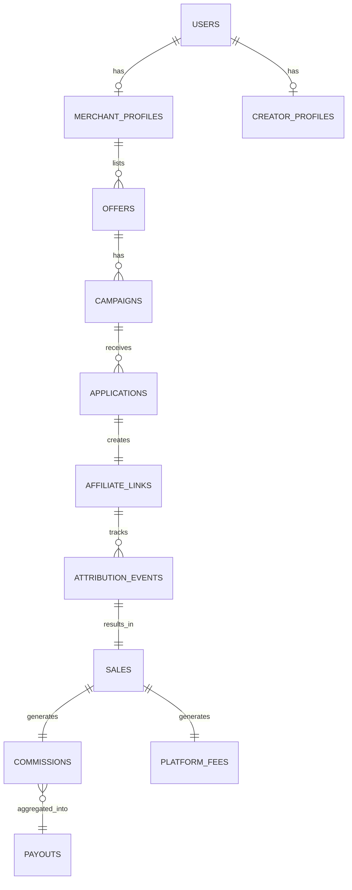

# ER Diagram

## Purpose

Visual/textual map of how every entity connects — companion to Table Specifications.

## Entity Relationship Summary

(Full field-level detail lives in Table Specifications; this is the shape.)

```
User
 ├── 1:1 → MerchantProfile (optional)
 └── 1:1 → CreatorProfile (optional)

MerchantProfile
 └── 1:N → Offer

Offer
 └── 1:N → Campaign

Campaign
 └── 1:N → Application

Application
 └── 1:1 → AffiliateLink (created on approval)

AffiliateLink
 └── 1:N → AttributionEvent

AttributionEvent (type=purchase)
 └── 1:1 → Sale

Sale
 ├── 1:1 → Commission
 └── 1:1 → PlatformFee

Commission
 └── N:1 → Payout (aggregated toward $50 threshold)

User
 └── 1:N → Notification
```

## Notes on Cardinality Decisions

- **One Application per approved link:** a creator can only have one active AffiliateLink per Campaign — prevents a creator generating multiple links for the same campaign to obscure attribution.
- **Commission and PlatformFee are separate rows, not just fields on Sale:** keeping them as distinct entities makes the financial ledger auditable per 01. Business Logic → Commission Engine's split math, and gives a clean place to record the 14-day refund clawback against a specific Commission row.
- **Payout aggregates many Commissions:** since payout is threshold-based ($50) rather than per-sale, a single Payout can (and usually will) represent multiple Sales/Commissions bundled together — needs a join table (see Table Specifications).

## Open Questions

- Whether PlatformFee needs its own table or can just be a field on Sale (leaning toward its own table for auditability, but it's a reasonable simplification either way for MVP)

## Diagram

