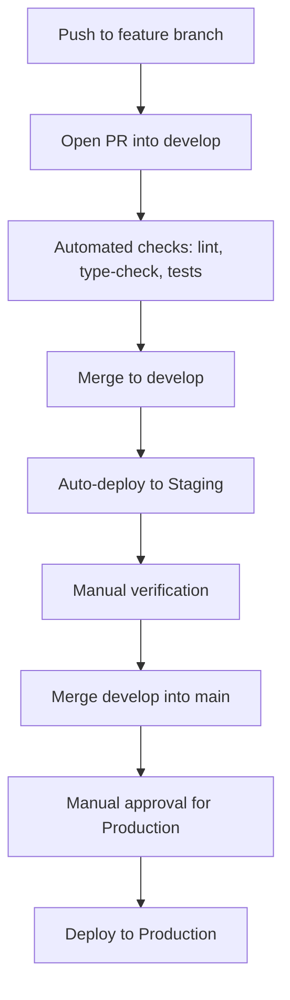
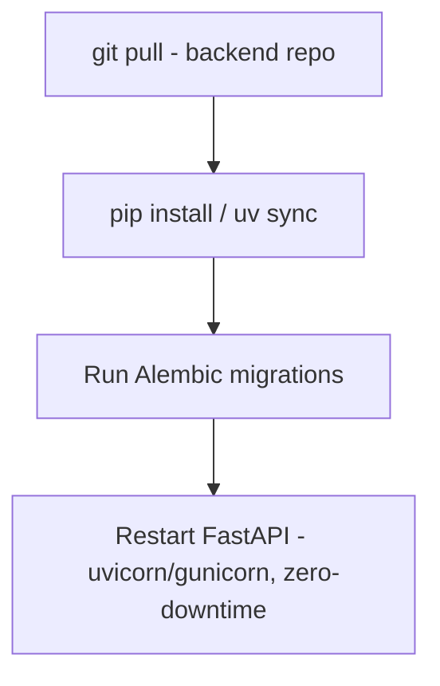

# CI/CD Pipeline

## Purpose

How code moves from a developer's machine to Production safely.

## Pipeline

```text
Push to feature branch
  ↓
Open PR into develop
  ↓
Automated checks run (lint, type-check, tests)
  ↓
Merge to develop → auto-deploys to Staging
  ↓
Manual verification on Staging
  ↓
Merge develop → main → auto-deploys to Production
```

## Tooling

GitHub Actions (per the original infrastructure conversation) — handles the automated checks and triggers deployment to the VPS.

## Deploy Mechanics (per original conversation, adapted for the current stack)

```text
git pull
  ↓
npm install
  ↓
Run database migrations (03. Database → Migration Strategy — as a distinct step, before app restart)
  ↓
npm run build
  ↓
Restart app (zero-downtime restart preferred — e.g. via a process manager like PM2)
```

## Why Migrations Are Called Out As Their Own Step

Given 03. Database → Migration Strategy's requirement that migrations run against Staging first and never bundle into app startup, this pipeline explicitly sequences migration-then-build-then-restart, rather than letting the app attempt to run against a schema it doesn't expect.

## Open Questions

- Whether Production deploys require manual approval (a human clicking "deploy") or are fully automatic on merge to `main` — recommend manual approval for Production specifically, given real money is at stake, even if Staging deploys automatically

## Diagram



## Update (2026-08-03): Two independent deploy paths

Following the FastAPI backend split, the "git pull u2192 npm install u2192 migrate u2192 build u2192 restart" mechanics above apply to the **frontend only**. The backend now has its own parallel path:



Frontend and backend can deploy independently (different repos or a monorepo with separate CI jobs — not yet decided, see Open Questions) since they're now separate services. The Staging-first, manual-approval-for-Production principles apply equally to both paths.

## Open Questions (new)

- Monorepo (one repo, two deploy jobs) vs. two separate repos for frontend/backend — either is workable; monorepo keeps them in sync more easily, separate repos give cleaner independent versioning. Worth deciding before the codebase grows large enough that switching is painful.

## Update (2026-08-04): Monorepo — Resolved

The earlier open question above ("monorepo vs. two separate repos") is resolved: **monorepo**, one repository with `apps/frontend` and `apps/backend`. Full reasoning and structure in 06. Infrastructure → Git Repository Strategy.

## Update (2026-08-04): Canary Stage Added Between Approval and Full Production

The manual approval step above now gates the *start* of a canary deployment, not an immediate full Production rollout — see 06. Canary Deployment & Automated Rollback for the full flow: approval → 5% traffic → automated error-rate-gated monitoring (15 min checkpoint, 30 min total) → automated promotion to 100% or automated rollback. The human decision point stays exactly where it was (approving the deploy); what happens after approval is now automated rather than an immediate all-at-once cutover.
