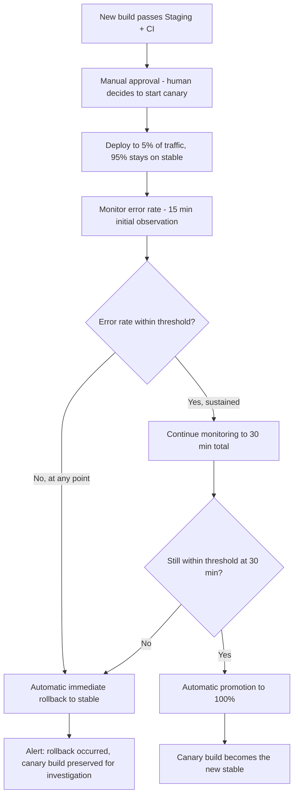

# Canary Deployment & Automated Rollback

## Purpose

Automated canary deployment with error-rate-gated promotion and rollback — the infrastructure-level counterpart to 06. Feature Flags Strategy. These two systems solve different problems and compose together, not substitutes for each other:

- **Canary deployment (this doc):** which *code version* serves a request — catches crashes, bugs, and regressions a build introduces, regardless of which features are flagged on
- **Feature flags (existing):** which *users* see a specific behavior — gates business/product risk, on a single stable codebase

**For a financial-chain change, both apply in sequence:** canary-deploy the build first (validates the code itself is sound) — once fully promoted, the new code is running everywhere, but the actual new *behavior* likely still sits behind a feature flag, progressively enabled for users per the existing beta → 5% → 100% pattern. Canary answers "is this build safe to run"; the feature flag answers "is this feature ready for users."

## Canary Deployment Flow



## Where the Human Stays in the Loop, and Where They Don't

- **Starting the canary:** manual approval, unchanged from 06. CI/CD Pipeline's existing Production gate — a human decides this build is ready to test against real traffic
- **Promote-or-rollback decision:** fully automated — a mechanical threshold check reacts faster and more reliably than a human watching a dashboard for 30 minutes, especially for the rollback case where speed directly limits damage
- **After an automatic rollback:** human-reviewed before retrying — the system doesn't automatically re-attempt the same canary; someone looks at why it failed first

## Traffic Splitting Mechanism

5%/95% split at the load balancer — Cloudflare Load Balancing (already in the stack) or Nginx weighted upstream routing across the canary vs. stable instance pools (06. Scaling Strategy's multi-worker setup provides the underlying instance pool this routes across).

## Error Rate Threshold (confirmed 2026-08-04)

**5xx response rate stays below 1% for the canary's traffic slice, measured against the same window's stable-version rate as a baseline** — comparing canary to a concurrent control, not just a fixed absolute number, since this accounts for normal baseline noise rather than reacting to it as a false alarm. Sourced from 06. Error Handling & Logging Pipeline and 06. Monitoring.

**For financial-chain builds specifically:** also gate on webhook/payment-callback failure alerts (06. Error Handling & Logging Pipeline's highest-scrutiny tier) — a single payment-callback failure during canary is reason enough to roll back immediately, even if the overall error rate is technically still under threshold.

## Feature Flag Cohort Tiers — Extended for Beta Users

Extends 06. Feature Flags Strategy's existing rollout pattern (`enabled_for_admin` → `rollout_percentage`) with an explicit beta cohort tier, matching the actual gating sequence requested:

```
enabled_for_admin (test it yourself first)
  → enabled_for_beta_cohort (Private Beta users, per 00. Product Roadmap's waitlist → beta invitation flow)
  → rollout_percentage: 5
  → rollout_percentage: 100
```

This requires adding a beta-cohort flag/targeting mechanism to the `feature_flags` table design — not previously specified, since the original design only had Admin-only and percentage rollout as tiers.

## Notification

Every automated promotion or rollback posts an internal alert (06. Monitoring); a rollback on a user-facing feature may also warrant a 10. Status Page update if it caused any visible disruption during its brief live window.

## Open Questions

None — threshold and timing both confirmed 2026-08-04.