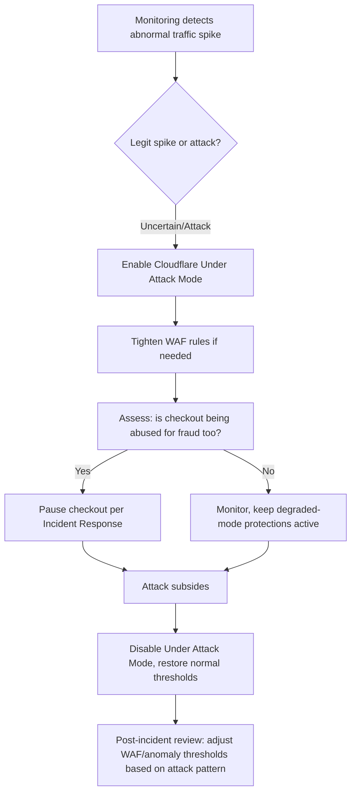

# DDoS Response Plan

## Purpose

A documented DDoS response process that exists **before** an attack happens — the entire value of this doc is that decisions get made now, calmly, instead of during an active incident.

## What's Already In Place (passive defense, always on)

- Cloudflare's network-layer (L3/L4) DDoS protection — automatic, no action needed
- Cloudflare WAF (06. Infrastructure → WAF Configuration) — L7 filtering
- IP-based anomaly detection with escalating throttle/ban (04. Security → IP Anomaly Detection & Escalation)

This doc covers what happens when passive defense isn't enough and a human needs to respond.

## Pre-Authorized Actions (the key idea: decide now, not during the fire)

Whoever is on call is **pre-authorized to take these actions immediately**, without waiting for founder approval in the moment — that approval is granted in advance, right here:

1. **Enable Cloudflare "Under Attack Mode"** — adds a JS challenge to all visitors; degrades legitimate user experience slightly but is reversible in seconds and stops most volumetric/bot attacks cold
2. **Tighten WAF custom rules temporarily** (lower the rate-based thresholds from WAF Configuration) if Under Attack Mode alone isn't suffient
3. **Pause checkout** (per 10. Operations → Incident Response's existing "money-critical → pause checkout" default) if there's any sign the attack is being used as cover for fraudulent transactions, not just a traffic flood

## Process

## Distinguishing a Real Attack From a Viral Traffic Spike

Worth naming honestly: a sudden traffic surge could be an actual DDoS, or it could be a creator's post going genuinely viral — the good version of "a lot of traffic." Under Attack Mode adds friction for real users too, so this is a judgment call, not a pure automatic trigger. Recommend erring toward enabling it first and disabling quickly if it turns out to be organic — the cost of a few seconds of extra friction for real visitors is much lower than the cost of an unmitigated attack during checkout.

## Communication

At current scale, a brief status message (per 10. Operations → Incident Response's existing stance — no dedicated status page needed yet) is sufficient; revisit if/when this happens often enough to justify more formal infrastructure.

## Open Questions

- Who exactly is "on call" and pre-authorized to act — at current team size this is presumably the founder, but worth stating explicitly here so it's never ambiguous in the moment