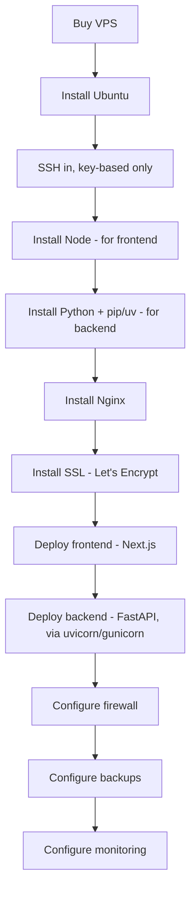

# VPS Setup

## Purpose

The actual server setup steps — directly from the earlier conversation, formalized as a reference doc.

## Spec (starting point, from the original conversation)

- Ubuntu Server 24.04
- 4 cores / 8 GB RAM / 160 GB SSD (adjust up once real traffic data exists — this was an illustrative starting spec, not a locked requirement)

## Setup Sequence

```text
Buy VPS
  ↓
Install Ubuntu
  ↓
SSH in (key-based only — see Security below)
  ↓
Install Node
  ↓
Install Nginx
  ↓
Install SSL (Let's Encrypt)
  ↓
Deploy app
  ↓
Configure firewall
  ↓
Configure backups
  ↓
Configure monitoring
```

Note: PostgreSQL is NOT installed on the VPS itself (see Hosting Strategy — managed Postgres instead), which simplifies this sequence compared to the original fully-self-hosted version discussed earlier.

## Security Baseline (from the original conversation)

- Firewall: only ports 80, 443, 22 open
- SSH: key-based only, no password login
- HTTPS: Let's Encrypt via Nginx
- No direct public exposure of any database (not applicable here anyway, since Postgres is managed and off-VPS)

## Open Questions

- None blocking — this is a direct carryover of the already-agreed-upon setup from the earlier conversation.

## Update (2026-08-03): Two runtimes now needed

Following the FastAPI backend decision, the VPS needs **both Node (for the Next.js frontend) and Python (for the FastAPI backend)** installed, not just Node. Updated setup sequence:



Nginx now routes to two upstream processes (frontend on one port, FastAPI backend on another) instead of one — see System Architecture's updated diagram.

## Update (2026-08-04): Multi-Worker Deploy (Load Balancing Active)

FastAPI backend now deploys as **gunicorn managing multiple uvicorn workers** (not a single process), with Nginx load-balancing across them — see 06. Scaling Strategy for the full reasoning. Worker count sized to VPS CPU cores once provisioned. No change to the Node/Python dual-runtime setup above, just how the backend process itself runs.
