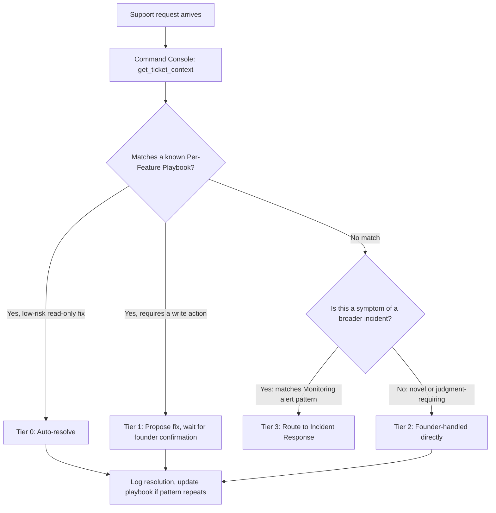

# Automated Resolution & Assisted Triage

## Purpose

How a support request gets diagnosed and either resolved automatically, resolved with AI assistance, or correctly escalated — the actual decision logic behind Support Tiers.

## Triage Flow

## What "Automated Resolution" Actually Means

Deliberately narrow, matching the console's existing fail-closed philosophy: automatic resolution is limited to actions that are **read-only, or write actions with negligible downside if slightly wrong** (e.g. resending an already-sent email doesn't hurt anything). Anything touching money, account status, or the financial chain **always** requires confirmation — automated resolution is not a backdoor around the console's existing write-action gate, it's a narrow allowance for genuinely low-risk actions only.

## Assisted Triage: What the Console Contributes

Even for Tier 2 (founder-handled) requests, the console still adds value by:

- Pulling `get_ticket_context` so the founder starts with full context instead of starting from zero
- Checking whether a similar request has occurred before (pattern detection across past resolutions), surfacing it even when no formal playbook exists yet
- Flagging explicitly when it has **low confidence** in a diagnosis — consistent with the console's fail-closed rule, an uncertain suggestion is labeled as uncertain, not presented with false confidence

## Feedback Loop: Triage Improves Playbooks

When a Tier 2 (novel) issue repeats a second time, that's the signal to promote it into a real Per-Feature Support Playbook — closing the loop between "things support actually deals with" and "what's documented," rather than the playbook set going stale relative to real ticket patterns.

## Open Questions

- None blocking — the triage logic is sound; specific auto-resolvable action list will grow incrementally as low-risk patterns are identified in real usage, not front-loaded speculatively now.