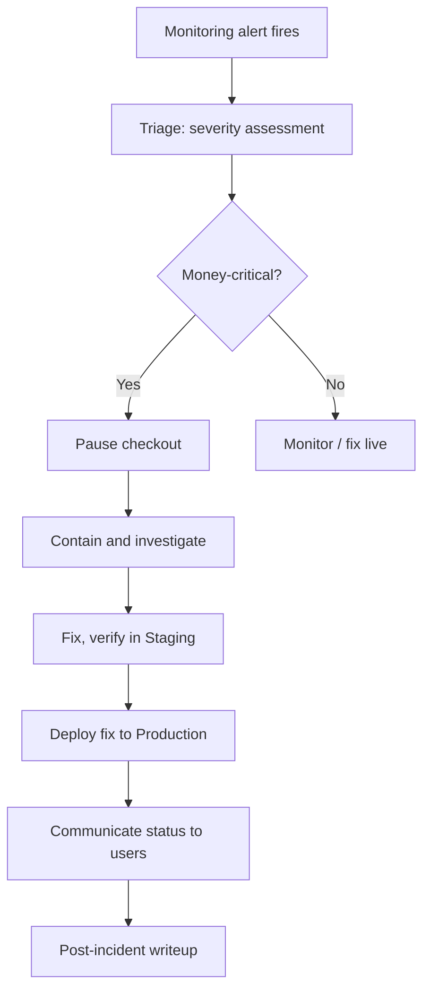

# Incident Response

## Purpose

The human process for handling a real incident — referenced as a dependency from multiple other docs (Disaster Recovery, Infrastructure Edge Cases, Failure Scenarios) but not designed until now.

## Process

1. **Detection** — via Monitoring (06. Infrastructure) alerts: app down, webhook failures, reconciliation mismatch, elevated error rates
2. **Triage** — Admin/founder assesses severity: is this affecting checkout (money-critical) or a non-critical feature?
3. **Containment** — for a money-critical incident (e.g. a reconciliation mismatch suggesting incorrect commission splits), the recommended default is to **pause new checkouts** rather than let potentially-incorrect transactions continue accumulating, even though this costs the business real activity in the moment — a wrong financial split multiplying across many sales is worse than a temporary checkout pause
4. **Communication** — status update to affected users (a simple status message is sufficient at current scale; a dedicated status page is a reasonable later addition, not needed for MVP)
5. **Resolution** — fix applied, verified in Staging first when at all possible even during an incident, per the existing CI/CD discipline
6. **Post-incident** — brief internal writeup: what happened, what was affected, what changes as a result — doesn't need to be elaborate at this scale, but should exist so the same failure mode isn't repeated silently

## Open Questions

- Exact severity thresholds for "pause checkout" vs. "monitor and fix live" — reasonable to lean conservative (pause more readily) while the platform is small and trust is still being established, loosen as operational maturity increases

## Diagram

## Update (2026-08-04): Flag Flip Before Full Checkout Pause

For a financial-chain bug traced to a specific recently-shipped feature, the first response is now flipping its feature flag off (06. Infrastructure u2192 Feature Flags Strategy) u2014 faster and more targeted than pausing checkout entirely. Full checkout pause remains the right call when the issue isn't isolated to one flagged feature, or predates flag-based rollout.

## Update (2026-08-04): Status Page Decision Reversed

The earlier stance above ("a simple status message is sufficient at current scale... a dedicated status page is a reasonable later addition, not needed for MVP") is **reversed by explicit request** — see 10. Operations → Status Page & Incident Communication for the full workflow, now built for MVP: separate domain, separate infrastructure, formal Investigating→Identified→Monitoring→Resolved communication cadence, and scheduled maintenance announcements.

## Update (2026-08-04): One-Page First Response Checklist

The full workflow above is the process; this is the literal first-10-minutes checklist for when an alert fires, in order:

1. **What exactly failed?** Check Better Uptime (06. Monitoring) — is it the health endpoint, the frontend, or something specific?
2. **Is it actually SellVia, or a dependency?** Check Paddle status, Supabase/Neon status, Cloudflare status, Ory Network status — in that order of likelihood given 08. Failure Modes Registry (Cloudflare is the single largest concentration of risk in the stack — check it early, not last)
3. **Did something just deploy?** Check the last Git tag/release (06. Git Repository Strategy's semantic version tags) — if an incident starts right after a deploy, that's the prime suspect
4. **Is it tied to a specific recent feature flag?** If yes — flip it off first (06. Feature Flags Strategy), before anything more drastic. Faster and more targeted than a full rollback.
5. **Check Error Handling & Logging Pipeline (Sentry)** for the actual error — not guessing, reading the real stack trace and how many users/requests are affected
6. **Is this money-critical?** (touches checkout, Sales, Payouts) — if yes and not resolved by step 4, pause checkout per this doc's existing flowchart
7. **Post to the status page** (Investigating) — don't wait until it's diagnosed; post as soon as you know something's wrong
8. **Then** work the full diagnosis — the rest of this doc's process takes over from here

This checklist exists so the first response doesn't depend on remembering the full process under stress — it's the muscle-memory version.
