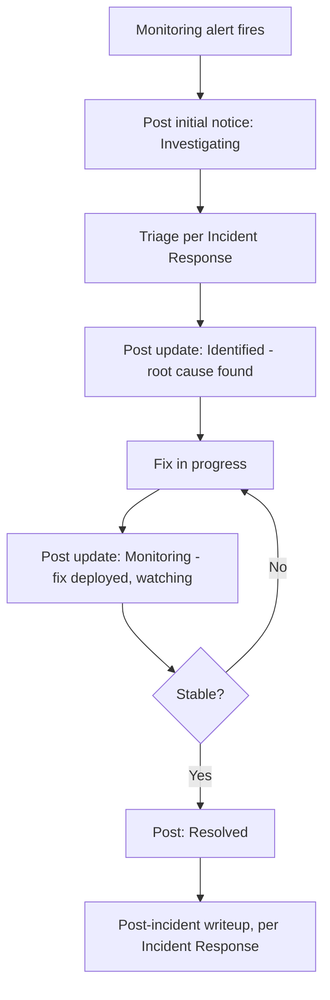

# Status Page & Incident Communication

## Purpose

A status page that stays up when SellVia's own infrastructure doesn't — plus the scheduled-maintenance and incident-communication workflows built around it. This reverses the earlier stance in 10. Operations → Incident Response and 06. Infrastructure → Disaster Recovery, both of which said a dedicated status page "isn't needed yet" — explicitly upgraded here by request.

## Why a Separate Domain, Not Just a Subdomain

**The entire point of a status page is that it stays reachable when the main stack is down.** A subdomain like `status.wesellvia.com` still depends on the same DNS zone, and if Cloudflare (already the DNS/CDN layer for the main site) has its own outage, a same-account subdomain could go down right alongside the thing it's supposed to report on. **Decided: a genuinely separate domain, on separate infrastructure, ideally a separate DNS/registrar path entirely** — not just a different hostname on the same setup.

## Recommended Approach: Managed Status Page Tool, Not Self-Hosted

Consistent with the pattern used throughout this entire build (Paddle for payments, Clerk for auth, Supabase for the database — use a managed service for undifferentiated, high-reliability infrastructure rather than building it in-house): a dedicated status page SaaS (e.g. Instatus, Better Uptime, or similar) run on its own robust infrastructure, completely decoupled from SellVia's VPS/Cloudflare stack. Self-hosting a status page defeats its own purpose — if it's hosted on the same infrastructure it's meant to report on, it fails at exactly the moment it's needed most.

## Scheduled Maintenance Announcements

- Planned maintenance (VPS upgrades, database migrations per 03. Database → Migration Strategy, major deploys) gets a pre-announced window on the status page — posted ahead of time, not discovered by users when something's briefly unavailable
- Most status page tools support built-in email/SMS subscriptions — Merchants and Creators can opt in to be notified directly, rather than needing to check the page proactively
- Maintenance windows should be coordinated with 06. Infrastructure → CI/CD Pipeline's deploy timing — scheduled during low-traffic periods where possible, and always announced before the window starts, not after

## Incident Communication Workflow

Formalizes what 10. Operations → Incident Response previously left as "a simple status message is sufficient":

**Status levels** (standard status-page convention): Investigating → Identified → Monitoring → Resolved. Every level gets a real update posted, not just a final "resolved" notice after the fact.

**Update cadence during an active incident:** at minimum on every status-level change; for a prolonged incident, a regular cadence (e.g. every 30 minutes) even without a status change, so "no update" never reads as "nobody's working on it."

**Who posts:** the same on-call person/founder identified in Incident Response — explicitly the same person, not a separate communications role at current team size.

**Tie-in to checkout pauses:** if a financial-chain incident triggers a checkout pause (10. Operations → Incident Response, 06. Infrastructure → Feature Flags Strategy), the status page reflects this immediately — users attempting to buy through a paused checkout should see a status page explanation, not just a broken-looking page.

## Open Questions

- Specific tool choice (Instatus vs. Better Uptime vs. others) — reasonable to compare based on pricing/features once ready to set this up, doesn't block the workflow design above
- Exact domain name for the status page — needs to be registered separately, worth deciding alongside the tool choice