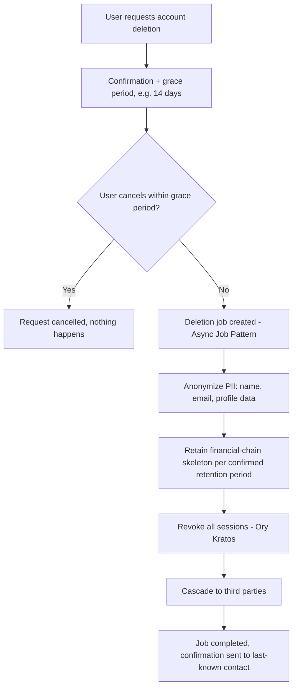

# Data Retention Policy Engine

## Purpose

A configurable engine that enforces data retention per category, maps those periods toward real legal/regulatory obligations, and produces an audit trail proving the policy was actually followed — not just stated. Retention periods below are **defensible defaults, explicitly not verified legal advice** — same status as the tax/VAT and India IT Rules items already deferred to end-of-build compliance review.

## Architecture: Policy-as-Data, Not Policy-as-Code

Retention rules live in a `retention_policies` table, not scattered as hardcoded logic across the codebase — a policy change (once legal confirms real numbers) is a data update, not a code change or redeploy.

```
retention_policies
  id
  category            (e.g. "financial_records", "user_pii", "audit_logs")
  retention_period    (e.g. interval, or "indefinite")
  legal_basis         (nullable — filled in once confirmed by counsel, e.g. "IRS 7-year record rule")
  action_on_expiry    (anonymize / hard_delete / archive)
  confirmed           (boolean, default false — distinguishes a real legal-confirmed policy from a placeholder default)
```

## Retention Categories and Working Defaults (unconfirmed unless noted)

| Category | Default | Action on expiry | Status |
| --- | --- | --- | --- |
| **Financial chain** (Sales, Commissions, Payouts, Platform Fees, Refunds) | 7 years (commonly-cited baseline, matches 03. Database → Audit Log Design's existing "indefinite until confirmed" stance) | Archive to cold storage, never hard-deleted | ⚠️ Placeholder — needs accountant/legal confirmation against actual operating jurisdictions |
| **Audit logs** | Same as financial chain (they exist to support disputes about it) | Archive | ⚠️ Placeholder |
| **User PII** (name, email, profile data) | While account active; on deletion/closure, **anonymized**, not hard-deleted | Anonymize (see below) | Mechanism confirmed, exact trigger timing not yet set |
| **Operational/application logs** (06. Infrastructure → Logging) | 30–90 days (already decided there, unchanged) | Hard delete | Confirmed, low legal sensitivity |
| **Session history** (04. Security → Session Management) | 90 days (working default) | Hard delete | ⚠️ Placeholder |
| **AI/token usage events** (11. Analytics) | 1–2 years | Hard delete | Business choice, not a legal driver — lower stakes to get wrong |
| **Email suppression list** (unsubscribes, bounces) | **Indefinite — this one is NOT a placeholder.** Anti-spam regulations (CAN-SPAM, CASL, and similar) generally require honoring unsubscribes permanently; purging a suppression list risks re-emailing someone who opted out, which is the actual violation | Never purged | Confirmed — well-established practice, low ambiguity |

## The Right-to-Erasure Tension, Resolved by Anonymization

A real user request to delete their data (common under privacy regimes) conflicts directly with the legal obligation to retain financial records — SellVia can't simply delete a Sale/Commission row because the Creator who earned it asks to be forgotten. **Resolution: anonymize PII fields (name, email, profile data) while retaining the transactional skeleton** (amounts, dates, relationships) needed for the financial retention period above. This extends 03. Database → Soft Delete Policy's existing "never hard-delete the financial chain" principle with the specific mechanism for handling an erasure request against it.

## The Engine (Scheduled Enforcement)

A Celery job (02. Background Jobs) runs on a schedule (e.g. daily), walks every `retention_policies` row, and for any data past its retention window, executes the configured `action_on_expiry`. This is what makes the policy real rather than aspirational — a documented policy nobody enforces provides no actual compliance value.

## Audit Trail: Proving the Policy Was Followed

Every retention sweep logs its own execution to a `retention_audit_log`:

```
retention_audit_log
  id
  policy_id           (FK -> retention_policies)
  run_at
  records_affected
  action_taken
  status              (success / partial / failed)
```

This is what actually proves compliance during an audit or dispute — not the policy document itself, but a record that the engine ran, on schedule, and did what the policy said. Ties into 03. Database → Audit Log Design's existing framework rather than duplicating it as a separate system.

## What This Doc Does NOT Do

It does not assert that the default periods above are legally correct for SellVia's actual operating jurisdictions — the `confirmed` flag on each policy exists specifically to distinguish "the engine is enforcing a placeholder" from "the engine is enforcing counsel-verified law." Treat every ⚠️ row as active technical debt against the compliance review already deferred to end of build, not as settled.

## Open Questions

- All ⚠️-marked periods above, pending real legal/accounting input — the engine is ready to receive the real numbers the moment they exist
- Exact PII anonymization trigger: on explicit user request only, or also automatically after a period of account inactivity/closure — not yet decided

## Update (2026-08-04): User-Initiated Deletion Pipeline

The retention engine above handles time-based expiry automatically. This adds the **user-initiated** flow — what actually happens when someone requests account deletion, built on 02. Async Job Pattern & Idempotency since this is exactly the kind of heavy, multi-step operation that pattern exists for.

## Flow



## Grace Period — Working Default, Please Confirm

**14 days between request and actual processing**, cancellable by the user at any point in that window. Protects against accidental requests and account-takeover-driven malicious deletion (someone else requesting deletion on a compromised account) — not previously specified anywhere.

## What Happens to Each Data Category (per 04. Data Inventory & Disclosure)

- **Account identity, profile data:** anonymized (name/email replaced with a non-identifying placeholder), never hard-deleted — unchanged from this doc's existing right-to-erasure resolution
- **Financial chain (Sales, Commissions, Payouts):** retained in full per the confirmed retention period (currently a placeholder pending legal confirmation, same as elsewhere in this doc) — the transactional skeleton survives even though the identifying PII around it doesn't
- **Sessions (Ory Kratos):** fully revoked, not retained
- **Uploaded files (product images, profile photos):** deleted from object storage, except where a product image is still referenced by an active Campaign another party depends on — flagged as a genuine edge case not yet resolved (see Open Questions)

## Cascading to Third Parties — Not Automatic Everywheren**This is the part most likely to be incomplete without explicit per-provider work:**n- **Ory Kratos:** identity deletion via its own API — straightforwardn- **Stripe Connect:** cannot simply delete an account with payment history — Stripe's own retention rules apply independently of SellVia's; the SellVia-side profile anonymizes, but Stripe-side KYC/transaction records follow Stripe's own policy, outside SellVia's controln- **Email ESPs:** address moves to the suppression list (04. Data Retention Policy Engine's existing "never purged" rule for suppression data) — deliberately NOT deleted, since removing it risks re-emailing someone who explicitly leftn- **AI/embeddings provider:** depends on the specific provider's own data handling — not yet verified per-provider, flagged as an open itemnn## Audit TrailnEvery deletion request and its outcome logged to `retention_audit_log` (04. Data Retention Policy Engine's existing audit mechanism) — proves the pipeline actually ran, not just that a policy exists.nn## Open Questionsn- Grace period length (14 days) — working default, needs confirmationn- Product image handling when still referenced by an active Campaign after the owning Creator/Merchant requests deletion — genuinely unresolvedn- Per-provider data deletion verification (AI/embeddings provider specifically) — not yet done

## Update (2026-08-07): RESOLVED — Immediate Removal, Placeholder Shown

**Founder-confirmed:** when an account is deleted, its product images are removed from object storage immediately as part of the deletion pipeline — not deferred until a referencing campaign ends. Any campaign (active, ended, or historical) that referenced the image now displays a placeholder image instead of a broken link or a lingering copy. This is simpler than the alternatives considered (keep-until-campaign-ends, keep-permanently) and consistent with the deletion pipeline's overall bias toward actually removing what a user asked to be removed, rather than a wide range of "keep it around just in case" carve-outs.