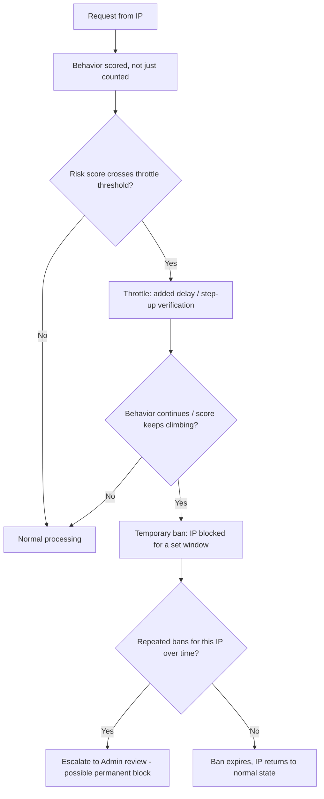

# IP Anomaly Detection & Escalation

## Purpose

Detect and escalate against abusive IPs based on **behavior patterns, not just request volume** — a distinct, complementary layer to 04. Security → Rate Limiting (which is fixed-threshold, per-endpoint) and 06. Infrastructure → WAF Configuration (which is edge-level, signature-based).

## Why Volume Alone Isn't Enough

A fixed "N requests per minute" rule (Rate Limiting) misses genuinely suspicious behavior that stays under any reasonable volume threshold — e.g. an attacker slowly testing 20 stolen card numbers over an hour, one every few minutes, never trips a rate limit but is still clearly card-testing fraud (04. Security → Fraud Prevention already names this risk pattern; this doc is the traffic-level detection layer feeding into it).

## Behavioral Signals (not just count)

- **Diversity of failed attempts:** many different card numbers, many different Application submissions to different Campaigns, many different login attempts across different accounts — all from one IP
- **Pattern anomalies:** requests missing expected headers/referrers that a real browser session would have; sequences of actions too fast for a human (e.g. browse → apply → checkout in under a second)
- **Cross-referencing with Fraud Prevention's existing rules:** self-referral detection and device/session fingerprinting (04. Security → Fraud Prevention) feed into the same IP's risk score here, rather than being siloed as separate systems

## Escalation Model

## Mechanism

- Redis-backed risk score per IP (same Redis instance as Rate Limiting and Caching Strategy) — each suspicious behavioral signal increments the score, with a decay over time so an old, resolved flag doesn't permanently haunt an IP
- **Throttle** = added latency + step-up friction (e.g. requiring a fresh Clerk session check on sensitive actions, per 04. Security → Session Management's existing re-auth recommendation) rather than an outright block — preserves access for borderline/uncertain cases
- **Temporary ban** = IP blocked outright for a defined window (e.g. a few hours), applied only once the score clearly crosses a higher threshold than throttling alone
- **Escalation to Admin** = repeated temporary bans on the same IP over time route into the existing moderation queue (10. Operations → Moderation) for a human decision on permanent blocking

## Relationship to WAF Configuration

This is an **application-level, business-aware layer** — it understands SellVia-specific behavior (applying to many campaigns, checkout patterns) that Cloudflare's edge-level WAF has no visibility into. The two are complementary, not redundant: WAF stops generic attack signatures at the edge; this stops SellVia-specific abuse patterns that only make sense with knowledge of the business logic.

## Open Questions

- Exact score thresholds and decay rate for throttle vs. ban — reasonable to start conservative and tune against real abuse patterns once there's live traffic, rather than guessing precise numbers now
- Temporary ban duration (a few hours vs. a full day) — same reasoning, tune with real data