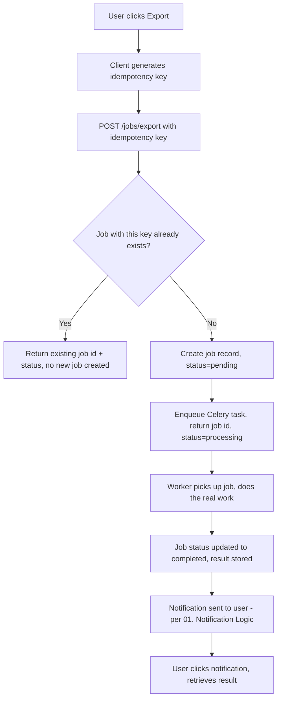

# Async Job Pattern & Idempotency

## Purpose

The pattern for any user-initiated operation too heavy to run inline in a request (exports, reports, bulk operations) — distinct from 02. Background Jobs' existing system-triggered jobs (payout batching, webhook processing). This is user-triggered, needs a job entity the user can reference, and completes via notification, not polling.

## The Rule

**No API route ever does heavy processing inline.** When a user clicks something expensive (export, bulk report, anything non-trivial), the route does exactly one thing: create a job record and return its ID immediately with `status=processing`. Actual work happens in a worker, off the request cycle entirely — the request/response is fast regardless of how long the real work takes.

## Flow



## Idempotency Keys — Preventing Duplicate Jobs

**Every job-creation request carries a client-generated idempotency key** (a UUID, generated once per user action — e.g. once when the export button is clicked, not regenerated on a rapid double-click of the same intent). Server checks for an existing job with that key before creating anything:

- **Key already exists → return the existing job's ID and current status.** No new job, no duplicate work, no duplicate notification.
- **Key doesn't exist → create the job, enqueue the work.**

This is the same principle already required for Paddle-touching endpoints (07. API → REST Standards' existing idempotency requirement), generalized to every job-creation endpoint, not just payment ones — a double-click, a flaky network retry, or an impatient second click all resolve to exactly one job.

## Job Schema

```
jobs
  id
  type              (e.g. "export_sales_report", "export_creator_earnings")
  status            (pending / processing / completed / failed)
  idempotency_key   (unique, client-generated)
  user_id           (who requested it)
  tenant_id         (per 04. Security → Tenant Isolation Audit — scoped, never cross-tenant visible)
  params            (jsonb — what was requested, e.g. date range, filters)
  result_url        (nullable — signed URL to the output once complete, per 03. Database → File Storage)
  error_message     (nullable — if failed)
  created_at
  completed_at
```

## Worker Pattern

A Celery task registered per job `type`, triggered when the job record is created — same underlying mechanism as every other background job (02. Background Jobs), same retry-with-backoff discipline. On success: write `result_url`, set `status=completed`, trigger notification. On failure: set `status=failed`, `error_message`, still notify the user (a silent failure the user never learns about is worse than a visible one) — logged per 06. Error Handling & Logging Pipeline like any other job failure.

## Completion: Notification, Not Polling

**Users are not shown a spinner waiting on this.** A new notification trigger, `job_completed` (extends 01. Business Logic → Notification Logic's existing trigger list), fires the moment the worker finishes — delivered via the existing notification channels (in-app + email, per 06. Email Infrastructure). A `GET /jobs/:id` endpoint still exists as a fallback for a user who wants to check manually or if a notification is missed, but it's not the primary UX.

## Tenant Scoping

A job's `GET /jobs/:id` (and the list of a user's own jobs) is scoped exactly like everything else per the Permission Matrix and Tenant Isolation Audit — a Merchant can never see another Merchant's export job, even by guessing an ID.

## Open Questions

- None blocking — this is a straightforward extension of already-decided patterns (Background Jobs, Notification Logic, idempotency keys already required for Paddle). Specific job `type`s get added as actual export/report features are built.