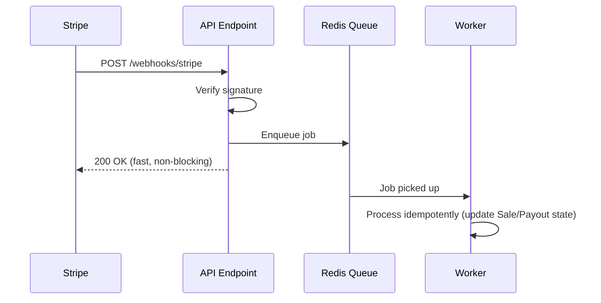

# Event-Driven Architecture

## Purpose

Where SellVia relies on events (mostly from Stripe) rather than direct synchronous calls, and why.

## Why This Matters Here Specifically

Because SellVia processes real payments via Stripe, a lot of the system's state changes are driven by **webhooks**, not by the user's own request finishing. A checkout succeeding, a refund happening, a payout completing — these are all things Stripe tells SellVia about asynchronously, and the backend has to react correctly and idempotently.

## Key Events

| Stripe webhook | SellVia reaction |
| --- | --- |
| `payment_intent.succeeded` | Mark Sale as `verified`, credit creator/merchant balances (already split by Stripe), trigger notifications |
| `charge.refunded` | Mark Sale as `refunded`, apply the 14-day clawback rule (01. Business Logic → Commission Engine) |
| `payout.paid` | Mark Payout as `paid`, notify the recipient |
| `payout.failed` | Mark Payout as `failed`, retry per Payout State Machine, alert Admin if repeated |
| `account.updated` (Connect) | Update a Merchant/Creator's onboarding/KYC status — relevant for gating whether they can receive payouts yet |

## Reliability Requirements

- **Webhook signature verification** on every incoming Stripe webhook — non-negotiable, this is the primary attack surface for someone trying to fake a "sale" or "payout" event (see 04. Security → Webhook Security, not yet written)
- **Idempotent processing** — Stripe can and will redeliver webhooks; handlers must not double-credit a wallet if the same event arrives twice
- **Queue, don't process inline** — webhook handlers should enqueue a job and return 200 quickly, then process asynchronously (see Background Jobs), so Stripe doesn't time out and retry unnecessarily

## Open Questions

- Whether to build a generic internal event bus (for notification triggers, analytics events, etc. beyond just Stripe webhooks) now, or keep it simple and Stripe-webhook-specific for MVP — recommend keeping it simple until there's a second real event source that justifies the abstraction

## Diagram

## Update (2026-08-04): The Full Chain, Explicit u2014 SellVia's Actual Version

Restating this as one explicit sequence, translated from generic payment-webhook language into what actually happens here (no subscriptions exist in SellVia u2014 Platform Business Model & Pricing explicitly rejected that model in favor of a flat 2% fee, so this chain replaces "activate subscription" with what SellVia actually does):

**On `payment_intent.succeeded` (one verified event, one action, every time u2014 idempotency key prevents any repeat):**

1. **Verify signature first** u2014 nothing below runs if this fails (04. Webhook Security, unchanged, non-negotiable)
2. **Mark the Sale verified** (not "invoice paid" u2014 SellVia's equivalent record, 01. State Machines)
3. **Credit balances** u2014 commission and platform fee, already split by Stripe in the same transaction (01. Commission Engine)
4. **Update tenant-scoped access/state** u2014 the Creator's wallet balance, the Merchant's sale count, both tenant-isolated per 04. Tenant Isolation Audit
5. **Send the notification** u2014 "sale made," "commission earned" (01. Notification Logic)

**Trust boundary, restated plainly:** the *button* (frontend "pay" click) never triggers any of the above directly u2014 only the verified webhook event does. A user closing their browser right after paying still results in the full chain running, because it's driven by Stripe's event, not by the frontend completing a request. This was already the design (Event-Driven Architecture's whole reason for existing) u2014 restating it here as the explicit trust rule it always was.

**Double-charge prevention, restated:** Stripe redelivers webhooks by design (not a bug to guard against, an expected behavior to design for) u2014 idempotent processing means a redelivered `payment_intent.succeeded` for the same PaymentIntent ID is a no-op the second time, never a second credit. Already required (Webhook Security, Event-Driven Architecture); this is the same rule, not a new one.