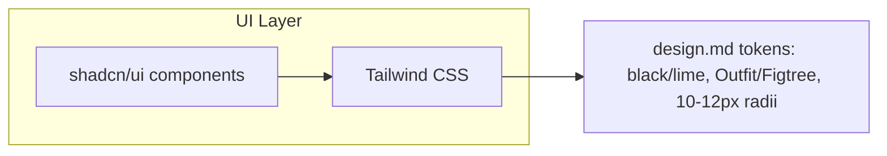

# Frontend Architecture

## Purpose

How the merchant dashboard, creator dashboard, and public-facing pages are built.

## Stack (proposed, consistent with the [design.md](http://design.md) system and existing tooling choices)

- **Framework:** Next.js (React) — matches the artifact/tooling ecosystem already in use for this project and supports both the marketing site and authenticated app in one codebase
- **Styling:** Tailwind, following [design.md](http://design.md)'s black/lime, Outfit/Figtree, no-gradients system directly
- **Auth integration:** Ory Kratos's SDK/components for sign-in, sign-up, and session state

## Surface Areas

1. **Public marketing site** ([wesellvia.com](http://wesellvia.com)) — already live, per the earlier read-through: hero, concept walkthrough, roadmap, FAQ, waitlist form
2. **Merchant dashboard** — campaign creation/management, application review, sales/analytics view, payout history
3. **Creator dashboard** — campaign discovery/browse, application status, link management, earnings/balance view
4. **Merchant billing card collection** — a Stripe Elements form for the merchant to add/update their card on file for periodic billing (reversed 2026-08-07, 01. Money Flow) — this is the only Stripe Elements surface remaining on SellVia's own frontend; there is no follower-facing checkout page, since purchases happen entirely on the merchant's own website
5. **Admin panel** — moderation queue, campaign vetting, refund/dispute handling (see 10. Operations, not yet written, for the operational workflows this supports)

## Design System Constraints (from [design.md](http://design.md) — binding, not optional)

- Colors: black (#000000) background, lime (#BFFF13) used sparingly for CTAs/highlights only
- Typography: Outfit for headlines/CTAs, Figtree for body/labels
- No gradients, no glassmorphism, no glow effects, restrained animation only
- 12-column desktop grid, thin borders over shadows

## Component Reuse Across Dashboards

Merchant and Creator dashboards share a lot structurally (list view, detail view, stats cards, notification feed) even though the content differs — recommend a shared component library (cards, tables, forms) rather than building each dashboard from scratch, so the "don't favor one side" design principle (Mission & Principles) is easier to enforce by construction.

## Open Questions

- Mobile app vs. responsive web only for MVP — raw data doc mentions mobile tracking apps, but responsive web is the leaner MVP scope
- Exact UX for the merchant's onboarding snippet install step (05. Payment Flow) — copy-paste instructions, guided setup, or an automated verification ping — not yet designed

## Stack Confirmed (2026-08-03)

**shadcn/ui + Tailwind CSS** — confirmed as the actual frontend component/styling stack, replacing the earlier "proposed" framing above. shadcn/ui components get themed directly against [design.md](http://design.md)'s tokens (black background, lime accent used sparingly, Outfit/Figtree, 10–12px radii, no shadows) rather than used with their default styling — the design system is binding, shadcn is just the component primitive layer underneath it.

## Diagram

