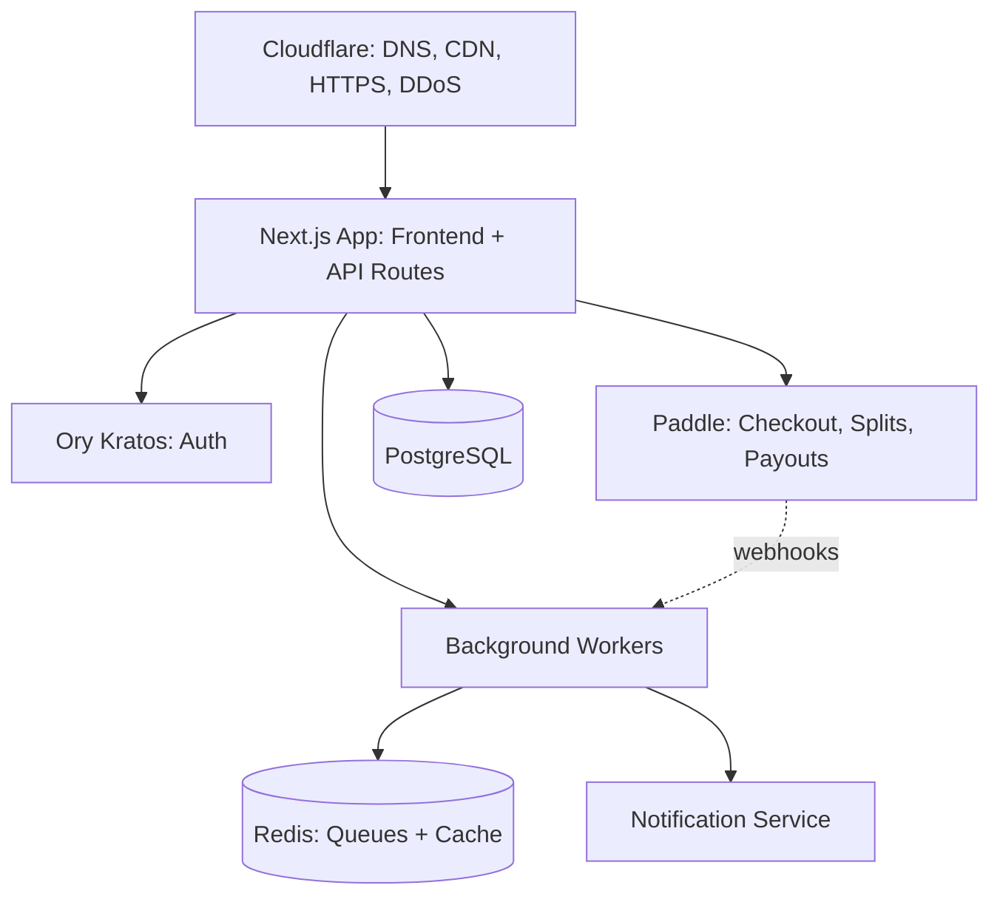
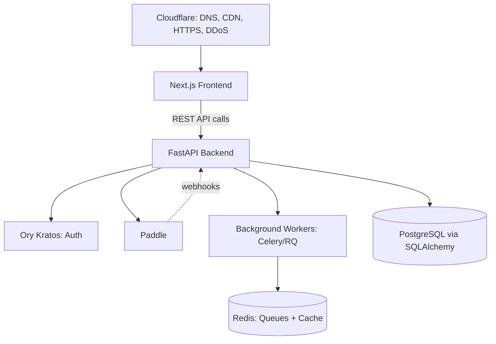

# System Architecture

## Purpose

The single picture of how all of SellVia's pieces fit together — every other doc in this section zooms into one part of this.

## High-Level Diagram

```text
               Cloudflare (DNS, CDN, DDoS)
                       ↓
               Next.js App (frontend + API routes)
                       ↓
       ────────────────────────────────────
       ↓                   ↓                       ↓
Clerk (auth)         Paddle          Background Workers
       ↓             (checkout, splits,          ↓
PostgreSQL           payouts, webhooks)      Redis (queues, cache)
(source of truth)         ↓                       ↓
       ──────────────→  Notification Service (email/push)
```

## Core Principle

SellVia is a **hosted-checkout marketplace**, not a click-tracking-only affiliate network (see 01. Business Logic → Money Flow). This shapes the whole architecture: the backend isn't just storing links and reading pixels — it's a real payments system built around Paddle, so correctness and auditability of money movement matter more than in a typical CRUD app.

## Major Components

1. **Frontend** — merchant dashboard, creator dashboard, public campaign discovery, hosted checkout pages (see Frontend Architecture)
2. **Backend / API** — auth-gated REST API serving the frontend and handling business logic (see Backend Architecture, API Design)
3. **Auth** — Clerk, handling sign-up/login/session for Merchant/Creator/Admin roles (see 04. Security → Authentication)
4. **Payments** — Paddle for checkout, the three-way split, and payouts (see Backend Architecture, and 01. Business Logic → Commission Engine/Money Flow for the business rules this implements)
5. **Database** — PostgreSQL as the single source of truth for all entities (see 03. Database)
6. **Background workers** — handle anything that shouldn't block a user-facing request: webhook processing, payout batching, notification delivery (see Background Jobs)
7. **Cache/queues** — Redis, for both caching and job queues (see Caching Strategy, Background Jobs)
8. **Notifications** — email/push delivery service triggered by backend events (see 01. Business Logic → Notification Logic for the business rules)

## AI Services Layer (proposed, post-MVP)

Discussed but not yet built: creator↔campaign matching, application screening assist, fraud/anomaly detection, disclosure-compliance assist. These would sit as a separate service the backend calls into (not embedded ad hoc per feature) — see AI Services doc below for the split of what's rule-based vs. ML vs. LLM-based.

## Environments

Per the earlier infrastructure conversation: Local → Staging ([staging.wesellvia.com](http://staging.wesellvia.com)) → Production ([wesellvia.com](http://wesellvia.com)), each with fully separate databases, Paddle modes (test vs. live), and file storage buckets. See 06. Infrastructure & DevOps (not yet written) for the full environment strategy — that conversation already covered most of this in depth and should be ported into Notion next.

## Open Questions

- Monolith (single Next.js app + API routes) vs. separate frontend/backend services — recommend starting monolithic for MVP speed, splitting later only if a specific bottleneck justifies it
- Whether background workers run on the same VPS as the main app or a separate box — depends on load, revisit once there's real traffic

## Diagram



## Update (2026-08-03): FastAPI Backend — Two-Service Architecture

The backend is now **FastAPI (Python)**, not Next.js API routes (see Backend Architecture for full detail). This changes the System Architecture diagram above from "one Next.js app doing everything" to two separate services talking over HTTP:



This means two deployable units, two environment-variable sets, and CORS between frontend and backend origins now genuinely matters (04. Security → API Security). See 06. Infrastructure for VPS/CI-CD updates reflecting this split.

## Update (2026-08-03): Monolithic FastAPI backend, not microservices

**Decided: the FastAPI backend is a single monolithic service**, not split into separate microservices (e.g. no separate Payments service, Campaigns service, Notifications service). Internally organized into clean modules (campaigns, applications, payments, notifications, etc.), but one process, one deploy, one database connection pool.

**Why:** microservices solve organizational problems (independent teams owning independent services) that don't exist at this team size, and they introduce real cost here specifically — this is a financial system where keeping a Sale, its Commission, and balance updates consistent is much simpler within one transaction boundary than coordinated across services. Matches Mission & Principles' "reduce complexity relentlessly."

**The one piece already separate:** background workers (Celery) run as their own process, since that's a natural, low-cost seam — not a step toward microservices, just standard separation of request-handling from background work. This is the one piece that could become independently scaled/deployed later without a redesign, if ever needed.

**Revisit only if:** the team grows enough to need independent ownership of specific domains, or a specific component (e.g. checkout processing under heavy load) demonstrably needs to scale independently from the rest — not before there's real evidence of either.

## Update (2026-08-04): Auth Provider Diagram Note

The "AUTH" node in the diagram above is now Ory Kratos (04. Security → Authentication, superseding the earlier Clerk decision) — Ory Network (managed) for MVP, self-hosted Kratos at scale. Called from the FastAPI backend as a REST API, same as Paddle/Supabase — no change to the overall modular-monolith shape, just a swapped external identity provider.
